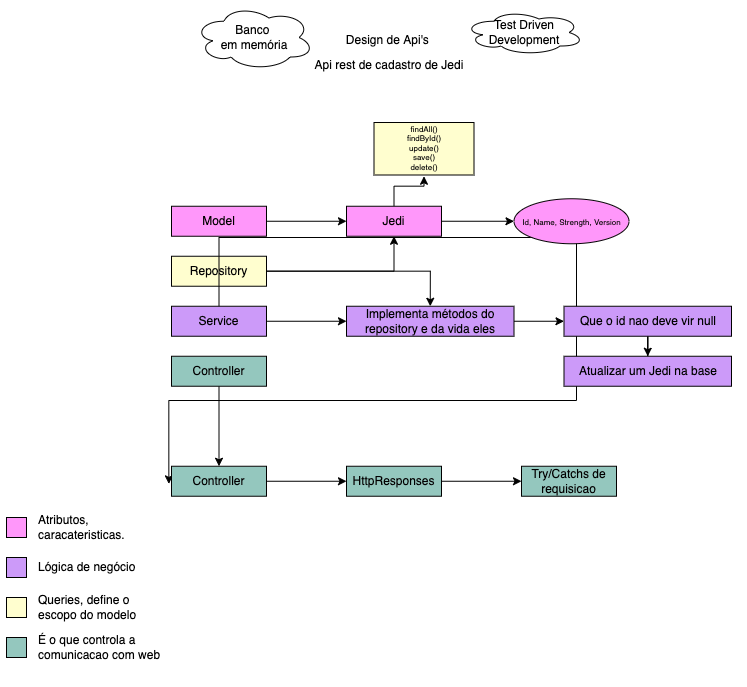

# TDD with start wars

Project to apply TDD

## Design of Rest API

 

## Technologies
- Java 11
- SpringBoot 2.6.5
- h2
- Junit 5
- JBDC Template

## Running the project

    mvn clean install

    mvn clean test

If you have problems with the packages, run:

    mvn clean package